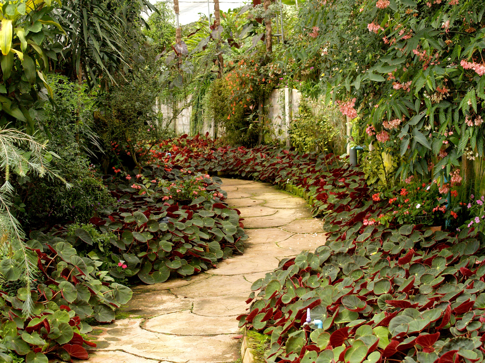

# Glory of the Garden

Tags: picoCTF 2010, Forensics

| Author | Point    |
| ------ | -------- |
| JEDAVIS/DANNY | 50 points |

## Description

This garden contains more than it seems.

## Solve

 Given a jpg file.



Check whether the flag string is embedded using the strings command.

```bash
$ strings garden.jpg | grep pico
Here is a flag "picoCTF{more_than_m33ts_the_********}"
```

## Flag

```
picoCTF{more_than_m33ts_the_********}
```